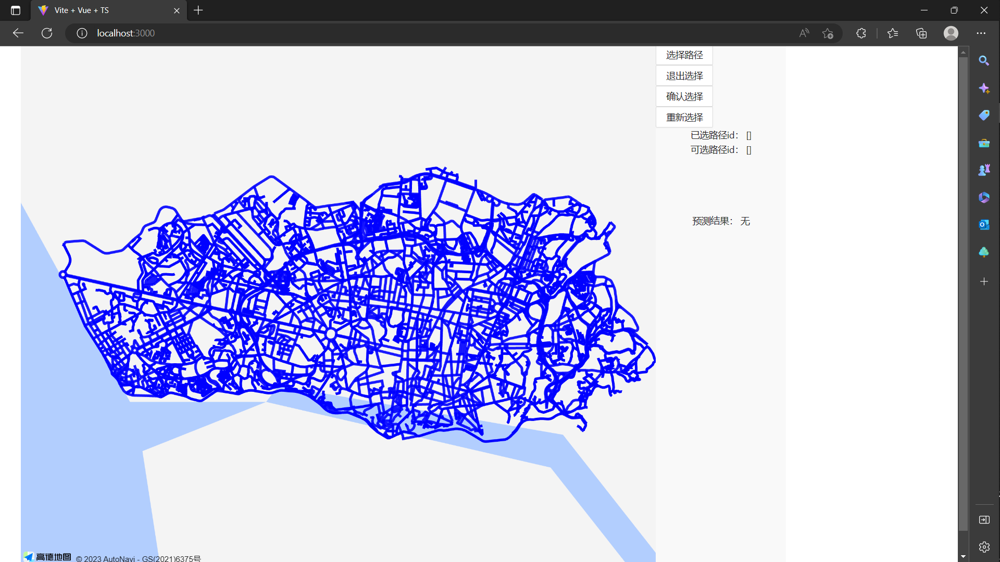

## 运行方式

在`pro`目录下运行前端

```
cd client
npm run dev
```

再开一个终端，在`pro`目录下运行后端

```
cd server/apps
python app.py
```

然后访问前端的网站

```
http://localhost:3000/
```



## 使用步骤

1. 点击【选择路径】，然后在左侧的路段中点击线段，选择若干路段
2. 点击【确认选择】，等一会就可以在网页右侧的【预测结果】中看到预测的时间